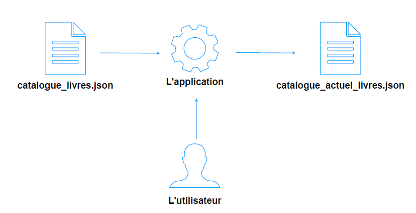
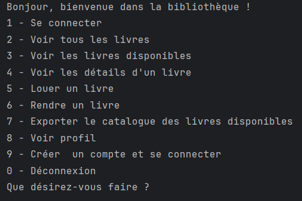

# BibliothequeExamen
Application simulant une bibliothèque.

# Gestion de Bibliothèque

Ce projet est une application Java permettant de gérer une bibliothèque de livres. Il inclut des fonctionnalités pour ajouter des lecteurs, louer des livres, et rechercher des ouvrages par ISBN. L'objectif principal de cette application est de fournir une interface simple pour la gestion des lecteurs et des livres dans une bibliothèque.

## Fonctionnalités principales

- **Gestion des livres** : Ajouter, afficher et rechercher des livres disponibles dans la bibliothèque.
- **Gestion des lecteurs** : Ajouter et suivre les lecteurs inscrits dans la bibliothèque.
- **Location de livres** : Permet à un lecteur de louer un livre en spécifiant l'ISBN.
- **Limite de location** : Un lecteur ne peut pas louer plus de 3 livres simultanément et ne peut pas louer plusieurs exemplaires d'un même livre.
- **Recherche par ISBN** : Possibilité de rechercher un livre spécifique en fournissant son ISBN.

## Technologies utilisées

- **Langage** : Java
- **Gestion des données** : Les livres et les lecteurs sont stockés dans des collections (`List`, `Set`) en mémoire.
- **Dépendances** : 
  - Utilisation de `Jackson` pour la sérialisation/désérialisation des données au format JSON.
  - `Scanner` pour l'entrée utilisateur.

## Installation et exécution

1. Clonez ce dépôt :
   ```bash
   git clone https://github.com/eloiseLBC/BibliothequeExamen.git

2. Packagez grâce à Maven:
   ```bash
   maven clean package
  
## Structure du projet
* Livre.java : Modélisation d'un livre avec ses propriétés (ISBN, titre, auteur, description, prix).
* Lecteur.java : Modélisation d'un lecteur, avec ses informations et la liste des livres qu'il a loués.
* Bibliotheque.java : Gère les lecteurs et les livres, et inclut les fonctionnalités pour louer des livres, afficher les livres disponibles, et gérer les interactions avec les lecteurs.
* Main.java : Classe principale permettant d'exécuter l'application et d'interagir avec la bibliothèque.

## Utilisation
* Se connecter à l'application à l'aide d'un id utilisateur.
* Ajoutez des lecteurs à la bibliothèque.
* Ajoutez des livres disponibles à partir d'un fichier JSON ou manuellement.
* Louez des livres en entrant l'ISBN correspondant.
* Consultez la liste des livres disponibles et des lecteurs inscrits.

Certains utilisateurs sont déjà enregistrés, mais si souhaité il est possible de créer un nouvel utilisateur.
````java
    Lecteur lecteur1 = new Lecteur(1, "Eloïse");
    Lecteur lecteur2 = new Lecteur(2, "Lou");
    Lecteur lecteur3 = new Lecteur(3, "Saaziley");
````

## Exemples
Voici un exemple d'ajout d'un livre à la bibliothèque :
````java
    Livre livre = new Livre("1234567890", "Le Petit Prince", "Un classique de la littérature", "Antoine de Saint-Exupéry", 15.99);
    bibliotheque.addLivre(livre);
````
    

## Structure des données
Les données assignées ont été réfléchies afin de spécifier l'ISBN comme identifiant. Voici un exemple de données possibles : 
```json
[
  {
    "isbn": "978-3-16-148410-0",
    "title": "The Data Science Handbook",
    "description": "A comprehensive guide to data science and machine learning.",
    "author": "John Smith",
    "price": 45.99,
    "quantity": 2
  },
  {
    "isbn": "978-1-4028-9462-6",
    "title": "Big Data for Beginners",
    "description": "An introductory book on big data concepts and technologies.",
    "author": "Jane Doe",
    "price": 39.95,
    "quantity": 1
  }]
```

## Architecture
<div align="center">
  
</div>
<div>
  <p>En entrée, l'application récupère les données d'un fichier .json recensant toutes les informations sur les livres. La bibliothèque enregistre tous les livres et un menu contextuel permet à l'utilisateur de naviguer en son sein.
</p>
</div>

<div align="center">
  
</div>
<div>
  <p>L'utilisateur peut se connecter ou se créer un compte afin de louer et/ou rendre des livres. Cepedant, même déconnecté, celui-ci peut voir les livres disponibles, les livres enregistrés par la bibliothèque et les détails d'un livre en particulier.
Une fois après avoir louer des livres (ou non), il est possible d'exporter en .json les données de tous les livres disponibles.

L'utilisation préconisée pour exporter les données est de donner un nom sans extension ``livres_disponibles`` et ensuite de spécifier le path du nouveau fichier.

</p>
</div>


## Executable
Le jar est exécutable sous tous les environnements, pour être certain que le jar soit correct, il est crucial de prendre le ``ExamJava-1.0-SNAPSHOT-jar-with-dependencies.jar``.

## Contributeurs
* Eloïse LE BLANC
